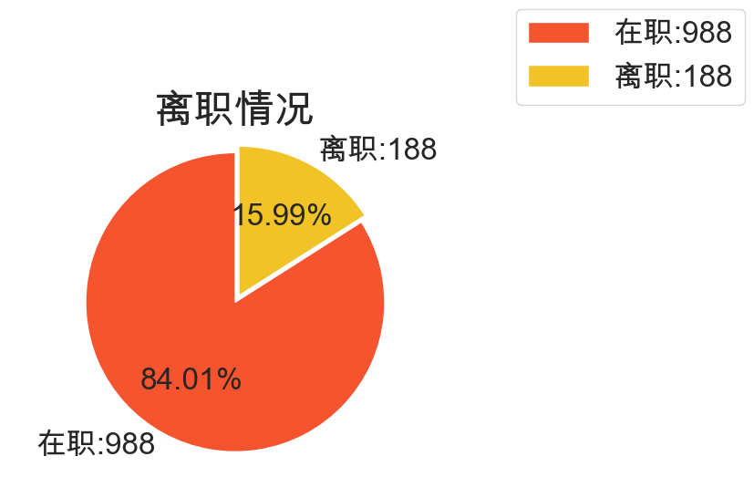

# ML 实验

## 数据集相关处理

> jupyter代码信息的提炼

### 数据初步诊断

首先，我们找到了数据源头，本数据集来自于[IBM Watson Analytics分析平台分享的样例数据](https://www.kaggle.com/competitions/bi-attrition-predict/overview)，在源头上知道了所有特征的含义以及取值

* 基于`data.describe() `，可以得到所有数值列的统计信息
  * 最大值等于最小值，代表所有项相同
    * EmployeeCount：员工数量，全为1
    * StandardHours：标准工作时间，全为80
* 遍历每个特征，基于`data[feature].unique()`可以得到所有分类特征数据的可能取值，只有一项代表只有一个取值
  * Over18：是否成年，全为Y

初步删除EmployeeCount、StandardHours、Over18三列

```python
x_data=pd.concat([data[numerical_cols],data[categorical_cols]],axis=1) # 所有列合并
x_data=pd.get_dummies(x_data) # 将所有字符串类型特征进行编码
corr = x_data.corr() # 计算各个列相关系数
```

### 相关性分析

本实验关性员工的离职，因此主要看分类特征Attrition的相关系数值，我们从大到小依次获得：

```
离职情况_Yes           1.000000
离职情况_No            1.000000
是否加班_No            0.225425
是否加班_Yes           0.225425
总工龄                0.181079
工作角色_销售代表          0.175908
员工年龄               0.175754
职业级别               0.172917
员工婚姻状况_单身          0.169450
在目前工作职责的工作年数       0.169024
员工月收入              0.163906
跟目前的管理者共事年数        0.163825
在目前公司工作年数          0.141555
股票期权水平             0.129769
商务差旅频率_经常出差        0.123936
员工工作投入度            0.114287
工作角色_实验室技术员        0.105588
工作满意度              0.098544
工作角色_制造总监          0.098481
员工对于工作环境的满意程度      0.095627
工作角色_研究总监          0.093478
员工婚姻状况_已婚          0.092287
员工所在部门_研发部         0.089975
商务差旅频率_不出差         0.083592
工作角色_经理            0.081992
员工所在部门_销售部         0.080562
员工婚姻状况_离婚          0.080551
员工所学习的专业领域_技术学位    0.079830
工作与生活平衡程度          0.073935
公司跟家庭住址的距离         0.072157
员工所学习的专业领域_市场营销    0.069331
平均每日工资             0.065743
工作角色_医疗代表          0.064363
员工所学习的专业领域_医疗      0.062215
上一年的培训时长           0.056043
员工所学习的专业领域_人力资源    0.055682
工作角色_人力资源          0.051005
商务差旅频率_不经常出差       0.049325
员工所学习的专业领域_生命科学    0.048633
距离上次升职时长           0.042846
工资提高的百分比           0.041065
员工性别_男性            0.038074
员工性别_女性            0.038074
员工曾经工作过的公司数        0.037556
关系满意度              0.034985
MonthlyRate        0.034358
员工的教育程度            0.033683
员工所在部门_人力资源部       0.028266
工作角色_科学研究员         0.013629
工作角色_销售主管          0.009841
用户id               0.009329
员工所学习的专业领域_其他      0.004304
HourlyRate         0.003484
绩效评估               0.001920
```

根据皮尔逊相关系数的基本概念，相关系数的取值与相关性：

|  相关性  | 取值范围 |
| :------: | :------: |
| 无相关性 |  0~0.09  |
| 弱相关性 | 0.1~0.3  |
|    中    | 0.3~0.5  |
|    强    | 0.5~1.0  |

**注意：虽然不同领域可能有不同的标准，但是这个表是可供参考的，参考来源**

> Cohen J. Statistical power analysis for the behavioral sciences[M]. Academic press, 2013.

因此我们筛选出相关系数大于0.1的所有特征，包括13列：

```
'是否加班', '总工龄', '工作角色', '员工年龄', '职业级别', '员工婚姻状况', '在目前工作职责的工作年数', '员工月收入', '跟目前的管理者共事年数', '在目前公司工作年数', '股票期权水平', '商务差旅频率', '员工工作投入度'
```

将小于0.1的所有列删除

### 异常检测

将筛选的数据集进行异常检测，根据数据来源的数据说明，剩余特征具体的含义以及取值内容：

| 数据集特征               | 中文含义                     | 取值                                                         | 数据类型     |
| ------------------------ | ---------------------------- | ------------------------------------------------------------ | ------------ |
| **Attrition**            | **员工是否已经离职**         | **Yes表示离职，No表示未离职**                                | **category** |
| **Age**                  | **员工年龄**                 |                                                              | **int**      |
| **BusinessTravel**       | **商务差旅频率**             | **Non-Travel不出差，Travel_Rarely不经常出差，Travel_Frequently经常出差** | **category** |
| **JobInvolvement**       | **员工工作投入度**           | **从1到4，1为投入度最低，4为投入度最高**                     | **int**      |
| **JobLevel**             | **职业级别**                 | **从1到5，1为最低级别，5为最高级别**                         | **int**      |
| **MaritalStatus**        | **员工婚姻状况**             | **Single单身，Married已婚，Divorced离婚**                    | **category** |
| **MonthlyIncome**        | **员工月收入**               | **范围在1009到19999之间**                                    | **int**      |
| **OverTime**             | **是否加班**                 | **Yes表示加班，No表示不加班**                                | **category** |
| **StockOptionLevel**     | **股票期权水平**             | **从0到3，0为无相关水平，3为水平最高**                       | **int**      |
| **TotalWorkingYears**    | **总工龄**                   | **员工总共工作时间**                                         | **int**      |
| **YearsAtCompany**       | **在目前公司工作年数**       |                                                              | **int**      |
| **YearsInCurrentRole**   | **在目前工作职责的工作年数** |                                                              | **int**      |
| **YearsWithCurrManager** | **跟目前的管理者共事年数**   |                                                              | **int**      |

**异常检测方法：**

* 取值是否在规定范围：

职业级别在1-5之间

月收入1009 ~ 19999

股票期权水平 0-3

工作投入度 1-4

* 含义规则

由于数据集严格按照职工标准，因此对于数值型数据，只要数值在合理的范围，那么就不能作为异常数据
检测异常数据的方法只能是自定义规则

1. 0 <= 在目前工作职责的工作年数 <= 在目前公司工作年数 <= 总工龄 < 员工年龄
2. 跟目前的管理者共事年数  <= 总工龄

原因：目前工作职责可能是临时的，应该最小，管理者共事可能在不同的公司等地方

### 划分数据集

```python
from sklearn.model_selection import train_test_split
train_fs0, test_fs0, train_ls0, test_ls0 = train_test_split(data0, data_label, test_size = 0.25, random_state=42) # 负例样本中抽取
train_fs1, test_fs1, train_ls1, test_ls1 = train_test_split(data1, data_label, test_size = 0.25, random_state=42) # 正例样本中抽取
train_fs = pd.concat([train_fs0,train_fs1],axis=1) # 训练集data
train_ls = pd.concat([train_ls0,train_ls1],axis=1) # 训练集label
test_fs = pd.concat([test_fs0,test_fs1],axis=1) # 测试集data
test_ls = pd.concat([train_ls0,train_ls1],axis=1) # 测试集label
```

分别对样本为真和样本为负的数据，按照3:1的比例划分数据集（单纯是因为3/7为无理数，不好求值），保证测试数据集的数据分布和原始数据集一致

> 保证分布一致的原因是，数据集的分布可能会在后续派上用场，比如异常检测等

## 数据采样



可见数据集中在职人数和离职人数的占比巨大，需要对数据进一步采样处理（无法直接处理字符串类型，因此对于决策树的采样工作，也需要先将数据集进行编码，采样之后再恢复

```python
data = pd.get_dummies(data)
```

* 过采样

  * smote算法

  ```python
  from imblearn.over_sampling import SMOTE
  sm = SMOTE(random_state=42)
  X_res, y_res = sm.fit_resample(X,y)
  data_smote = pd.concat([X_res, y_res], axis=1)
  ```

* 欠采样

  * 随机欠采样

  ```python
  from imblearn.under_sampling import RandomUnderSampler
  under_model = RandomUnderSampler()
  X_under, y_under = under_model.fit_resample(X, y)
  data_under = pd.concat([X_under, y_under], axis=1)
  ```

恢复算法：未实现


## 基本环境

1. opencv库函数编译和配置

## 决策树

## 神经网络

### 额外的数据处理

* 神经网络无法直接处理分类特征的字符串型数据，因此直接对采样后的数据进行处理

* 由于神经网络的运算过程对数值量级非常敏感（会进行很多除法、log等运算），需要对数据集进行[0-1]的正规化，防止值相差过大导致梯度消失或爆炸

```python
from sklearn.preprocessing import MinMaxScaler
import joblib # 保存归一化参数
transfer = MinMaxScaler(feature_range=(0,1))
# print(data[numerical_cols])
varient = transfer.fit(train_data[features]) # 正规化数据内容，不包括标签
result = varient.transform(train_data[features])
joblib.dump(varient, "scaler_upper.pkl")

# test
test_fs = transfer.fit_transform(test_fs) # 正规化内容
```

* 正规化之后，数据转为array，丢失标签，将正规的数据恢复到原数据集：

```python
for index in range(len(features)):
    true_index = 0 # 正则化后值的索引
    for i,row in train_data.iterrows():
        train_data.loc[i, features[index]] = result[true_index][index]
        true_index += 1
    true_index = 0
    for i,row in test_data.iterrows():
        test_data.loc[i, features[index]] = test_fs[true_index][index]
        true_index+=1
```

* 由于神经网络算法全部在c++环境实现，因此需要额外处理

### 开始用c++

根据神经网络实现的特点（包含大量的矩阵运算），因此选择使用`opencv`环境，因为其提供了`Mat`等方便进行矩阵运算的数据结构，同时也方便处理图像类型的数据

```c++
// 1，-2必须设定，否则就会默认最后一列为输出变量
#include <opencv2/opencv.hpp>
#include <opencv2/ml/ml.hpp>
...
int main() {
    // 读取csv数据 
    Ptr<ml::TrainData> raw_data = ml::TrainData::loadFromCSV("./data/TestData_upper_add.csv", 1, -2, 0); 
    Mat data = raw_data->getSamples();
    // 将输入的数据矩阵整理
    Mat input_ = data(Rect(1, 0, 26, data.rows)).t(); // 输入
    Mat label_ = data(Rect(0, 0, 1, data.rows)); // 输出
    Mat target_(2, input_.cols, CV_32F, Scalar::all(0.));
    for (int i = 0; i < label_.rows; ++i)
    {
        float label_num = label_.at<float>(i, 0);
        target_.at<float>(label_num, i) = label_num;
    }
    return 0;
}
```

### 算法实现

关键：libNet类实现算法

```c++
```


子系统中测试方法：
```bash
g++ Function.h Function.cpp libNet.h libNet.cpp MyNet.cpp -o MyNet  $(pkg-config --cflags --libs opencv4)
./MyNet
```
* 改进策略(按照优先顺序)
  1. 参数改进，可调参数：
     1. 学习率
     2. 训练次数
  2. 网络结构改进
     1. 不同的隐藏层以及每个层的神经元个数
  3. 数据集改进
     1. 数据采样方法
        - [x] 过采样
        - [x] 欠采样
     2. 数值正则化
        - [x] 全部统一正则
        - [x] 不正则
        - [x] 对分类特征数据进行数值类别转换
  4. 采用不同的激活函数
  5. 设定不同的停止阈值

| data | data-name | loss | 激活函数 | 网络结构 | 初始偏置 | 初始权重 | 学习率 | 训练轮次 | 准确率   | 备注     |
| ---- | --------- | ---- | -------- | -------- | -------- | -------- | ------ | -------- | -------- | -------- |
| D1   | smote     | <1   | sigmoid  | 26,50,2  | 0.05     | 0.01     | 0.01   | 500000   | running  |          |
| D2   | smote_add | <1   |          |          |          |          |        |          | 54.7619% |          |
| D3   | upper     | <1   |          |          |          |          |        |          | 68.7075% |          |
| D4   | upper_add | <1   |          |          |          |          |        |          | 46.9388% |          |
| D1   | smote     | <9   | tanh     | 26,50,2  | -        | 0.01     | 0.005  | 500000   | 57.8231% | 梯度爆炸 |
| D2   | smote_add |      |          |          |          |          |        |          | 48.2993% |          |
| D3   | upper     |      |          |          |          |          |        |          |          |          |
| D4   | upper_add |      |          |          |          |          |        |          |          |          |
| D1   | smote     | <1   | relu     | 26,50,2  | -        |          | 0.0005 | 500000   | 72.7891% |          |
| D2   | smote_add | <1   |          |          |          |          |        |          | 75.5102% |          |
| D3   | upper     |      |          |          |          |          |        |          | RUNING   |          |
| D4   | upper_add |      |          |          |          |          |        |          | 52.7211% |          |

* 由于初始权重都设置为相同的值，会导致输出为一个值，也就是没有得到充分训练时，输出的结果都是一个值

数据集

- [x] 对数据进行正则化
  - [x] 不做任何处理：D0
  - [x] 过采样：原始 - D1
  - [x] 过采样：对分类特征进行处理 - D2
  - [x] 欠采样：原始 - D3
  - [x] 欠采样：对分类特征进行处理 - D4

## 对比

## 总结

## 问题
* opencv在windows子系统下配置
  1. 无法编译成功（windows下需要非win32的另一个版本的mingw）
  2. 在子系统中编译需要将opencv编译文件放到ex文件系统（ubuntu目录下）
     3. 测试安装成功：`pkg-config --modversion opencv4`
  3. 配置好opencv后，还可能找不到具体的.so链接库，需要配置文件位置
     ```bash
     安装目录 > `/etc/ld.so.conf
     sudo /sbin/ldconfig -v
     ldconfig
  5. ```
  4. 编译写法：按照创建顺序写c++相关文件，h在前cpp在后，链接库：`$(pkg-config --cflags --libs opencv4)`
  5. 引入4.x版本opencv，头文件写法已经改变`<opencv2/opencv.hpp>`